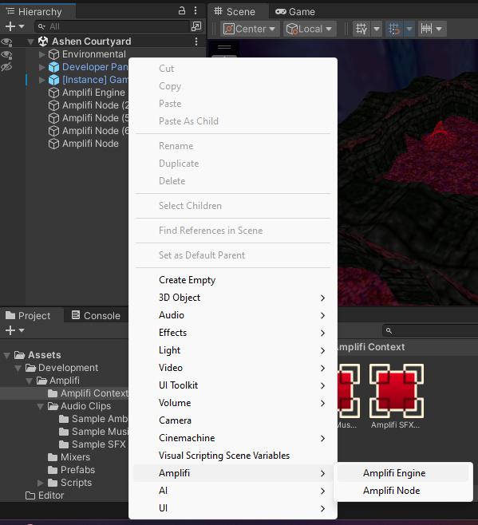
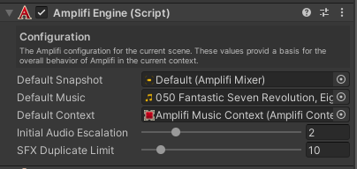

Introduction
============

In this section, you will be guided through setting up the Amplifi Engine via the Unity Editor.

What is Amplifi Engine?
=======================

This object is a singleton, only one Amplifi Engine may exist at any given time within the active scene.

Amplifi Engine is the core of Amplifi and is required in your scene for Amplifi to operate. Amplifi Engine manages all Amplifi backend functionality so you don’t have to!

Creating Amplifi Engine
=======================

For examples on how to create AmplifiEngine via the Amplifi API, visit [Amplifi.AmplifiEngine](../Amplifi_API/Amplifi.AmplifiEngine_29130763.md).

### Creating the Amplifi Engine

_This section assumes that the current scene does not yet contain an Amplifi Engine game object._

1.  To add the “Amplifi Engine” to your scene, open the GameObject menu, however you might prefer, and select ‘Amplifi’ > ‘Amplifi Engine’.  

    
2.  At this time, the Amplifi Engine is ready to be configured.  

    

### Configuring the Amplifi Engine

Now it is time to configure the Amplifi Engine object that you have just created. Below is a table, describing each available parameter.

<table data-table-width="1011" data-layout="default" data-local-id="f44e093b-2b44-4e99-9e6d-51bd712b2279" class="confluenceTable"><colgroup><col style="width: 190.0px;"><col style="width: 166.0px;"><col style="width: 195.0px;"><col style="width: 458.0px;"></colgroup><tbody><tr><th data-highlight-colour="var(--darkreader-bg--ds-background-accent-gray-subtlest, #1d2021)" class="confluenceTh">
<strong>Property</strong>
</th><th data-highlight-colour="var(--darkreader-bg--ds-background-accent-gray-subtlest, #1d2021)" class="confluenceTh">
<strong>Type</strong>
</th><th data-highlight-colour="var(--darkreader-bg--ds-background-accent-gray-subtlest, #1d2021)" class="confluenceTh">
<strong>Default Value</strong>
</th><th data-highlight-colour="var(--darkreader-bg--ds-background-accent-gray-subtlest, #1d2021)" class="confluenceTh">
<strong>Description</strong>
</th></tr><tr><td class="confluenceTd">
Default Snapshot
</td><td class="confluenceTd">
AudioMixerSnapshot
</td><td class="confluenceTd">
null
</td><td class="confluenceTd">
The default AudioMixerSnapshot for the active scene.
</td></tr><tr><td class="confluenceTd">
Default Music
</td><td class="confluenceTd">
AudioClip
</td><td class="confluenceTd">
null
</td><td class="confluenceTd">
The default AudioClip (Music Track) for the active scene. This AudioClip will be instantiated at run-time and will be reverted to unless otherwise specified when the current Music (Proximity) nodes is destroyed. This value may be null, resulting in silence.
</td></tr><tr><td class="confluenceTd">
Default Context
</td><td class="confluenceTd">
<a href="../Amplifi_Context_Configuration/Amplifi-Context-Configuration_29852062.md" data-linked-resource-id="29852062" data-linked-resource-version="3" data-linked-resource-type="page">AmplifiContext</a>
</td><td class="confluenceTd">
null
</td><td class="confluenceTd">
The default AmplifiContext used to apply configuration to the default track.
</td></tr><tr><td class="confluenceTd">
Initial Audio Escalation
</td><td class="confluenceTd">
float
</td><td class="confluenceTd">
0
</td><td class="confluenceTd">
The speed at which the base track volume is initially smoothed into its target volume.
</td></tr><tr><td class="confluenceTd">
SFX Duplicate Limit
</td><td class="confluenceTd">
int
</td><td class="confluenceTd">
10
</td><td class="confluenceTd">
Specifies the number of duplicate SFX clips of the same title that can be instanced at a time. For unlimited duplicates, set this value to 0.
</td></tr></tbody></table>